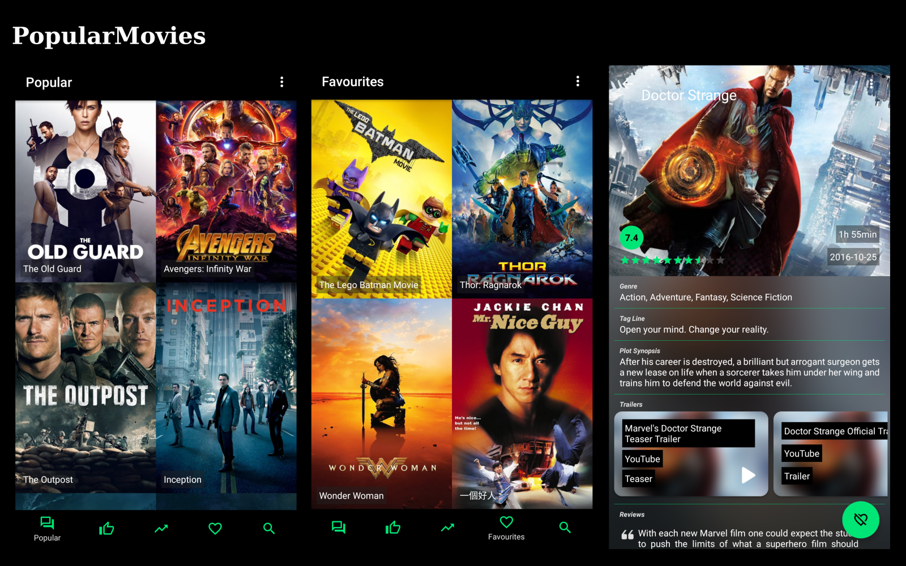

### PopularMovies

Check out what movies are popular and/or highest rated and add favourites to you collection! 

The app uses the TMDb API for movies. To get it working, an API key has to be provided. This can be retrieved form <a href='https://www.themoviedb.org/'>TMDb</a> by following the instructions provided there. After receiving the key, place it within the '<string name="api_key_value">[Your API key here]</string>' tag found in the strings resource file (app>src>main>res>values>strings.xml). This project is part of the Udacity Android Developer Nanodegree program.

  

 

### Project Overview
The project should accomplish: 
<ul>
<li>Fetching data from themovieDB API</li>
<li>Making use of Android Architecture Components (Room, LiveData, ViewModel and Lifecycle) to create a robust an efficient application</li>
</ul> 

<b>Go on... Movie it! Movie it!</b>
